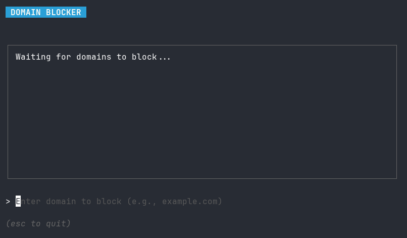

<h1 style="text-align: center;">Domain Blocker</h1>
An interactive TUI application to manage domain blocking through the system's hosts file. This application provides an easy way to block and unblock domains system-wide using a terminal user interface.



## Features
- Interactive terminal user interface
- Real-time domain blocking
- Automatic DNS cache flushing
- Cross-platform support (Windows, macOS, Linux)
- Automatic cleanup on exit

## Prerequisites
- Go 1.19 or higher
- Root/Administrator privileges (required for modifying hosts file and flushing DNS)

## Installation
```bash
go install github.com/4ster-light/phocus@latest
```

## Usage
1. Run the application with administrator privileges:
- On Unix-like systems:
```bash
sudo domain-blocker
```
- On Windows (run Command Prompt as Administrator):
```cmd
domain-blocker
```
2. Enter domains to block in the input field
3. Press Enter to block each domain
4. Press ESC to quit (all blocked domains will be automatically unblocked)

## How it Works
The application works by:
1. Modifying your system's hosts file (`/etc/hosts` on Unix-like systems, `C:\Windows\System32\drivers\etc\hosts` on Windows)
2. Adding entries that redirect specified domains to `127.0.0.1`
3. Automatically flushing your system's DNS cache after each modification
4. Cleaning up all modifications when you exit the application

## Dependencies
- [Bubble Tea](https://github.com/charmbracelet/bubbletea) - Terminal UI framework
- [Bubbles](https://github.com/charmbracelet/bubbles) - TUI components
- [Lip Gloss](https://github.com/charmbracelet/lipgloss) - Style definitions

## Security Considerations
- The application requires root/administrator privileges to modify the hosts file and flush DNS
- All modifications are reversed when the application exits
- Be careful when blocking domains as it may affect system functionality

## License
GNU General Public License v3.0
