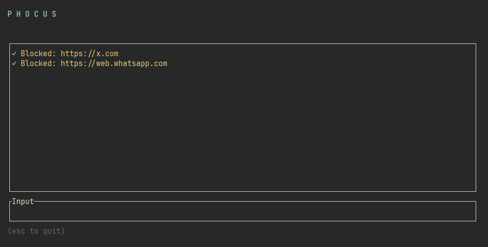

# Phocus

TUI application built in Rust to maintain your PHOCUS.



## Usage

```
cargo build --release
sudo ./target/release/phocus
```

This will open a TUI window where you can enter a domain to block, and then unblock it at exit.

## Installation

```
cargo install --path .
```

## License

GNU GPLv3
